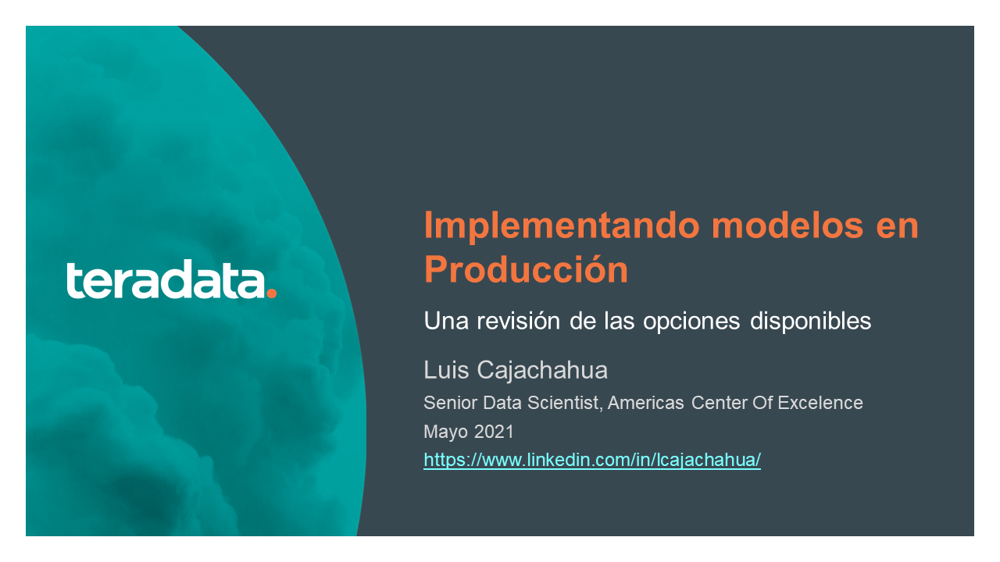

# Webinar DMC: Implementando modelos en Producción: Una revisión de las opciones disponibles

Materiales del Webinar del 13-May-2021

Puedes descargar la presentación haciendo clic derecho y eligiendo la opción "Descargar Como.." en este [ENLACE](docs/Modelos_en_Produccion.pdf)

Y desde aquí puedes acceder a la [grabación](https://youtu.be/G4azMRVG4K4) en Youtube:

## Referencias

La presentación ha sido desarrollada teniendo en cuenta los siguientes artículos.

1. [¿Cómo desplegar modelos de optimización en producción?](https://www.youtube.com/watch?app=desktop&v=pKTMU-ZH5zI&ab_channel=handytecAcademy)

2. [Hidden Tehnical Debt in Machine Learning Systems](https://papers.nips.cc/paper/5656-hidden-technical-debt-in-machine-learning-systems.pdf)

3. [Microfinance: A Way to Help the Poor Build Assets](https://www.microfinance.com/)

4. [Hands-On Machine Learning with Microsoft Excel 2019](https://www.amazon.es/Hands-Machine-Learning-Microsoft-Excel/dp/1789345375)

5. [Un proyecto heterodoxo de ciencia de datos: detección de fugas en Paypal](https://www.youtube.com/watch?app=desktop&v=u-BmTq_oYho&ab_channel=GilBellosta)

6. [Open Standards for Machine Learning Deployment](https://2019.berlinbuzzwords.de/sites/2019.berlinbuzzwords.de/files/media/documents/mlstandards-bbuzz-jun-19-np-compressed.pdf)

7. [Introduction to reusing models across languages](https://www.slideshare.net/tjanssens/machine-learning-standards)

8. [How to save trained Machine Learning Models?](https://medium.com/fintechexplained/how-to-save-trained-machine-learning-models-649c3ad1c018)

9. [How to save and load your Keras Deep Learning Model](https://machinelearningmastery.com/save-load-keras-deep-learning-models/)

10. [How to save (and load) datasets in R: An overview](https://www.r-bloggers.com/2019/05/how-to-save-and-load-datasets-in-r-an-overview/)

11. [Machine Learning Model](https://devopedia.org/machine-learning-model)

12. [Modelos en producción](https://centerforadvancedanalytics.ghost.io/modelos-en-produccion/)

13. [Deploying Scalable Machine Learning for Data Science](https://www.linkedin.com/learning/deploying-scalable-machine-learning-for-data-science/scaling-ml-models?u=2128889)

14. [Carlos de la Torre: Del POC a producción - Infraestructura para machine-learning](https://www.youtube.com/watch?app=desktop&v=-Sk0iEpX2c8&ab_channel=PyData)
